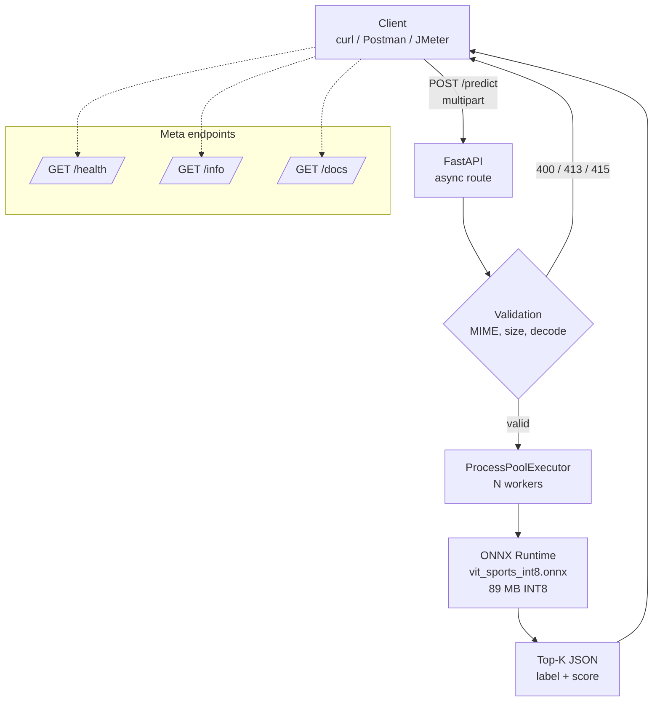
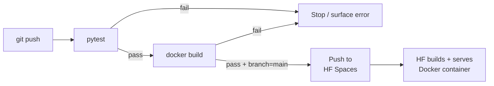

# System Architecture

## CI/CD pipeline

## Request lifecycle

1. Client sends `POST /predict` with `multipart/form-data` (`file=@image.jpg`).
2. FastAPI's async route reads bytes in 64 KB chunks; aborts at the size cap.
3. MIME whitelist + non-empty check → 415 / 400 if violated.
4. Bytes are forwarded to `ProcessPoolExecutor` via
   `loop.run_in_executor(pool, predict, image_bytes, top_k)`.
5. Worker preprocesses (resize → normalize → NCHW float32) and runs the
   INT8 ONNX session.
6. Worker softmaxes the logits, picks top-K, returns `(labels, time_ms)`.
7. Route serializes `PredictResponse` (Pydantic) and returns JSON.
